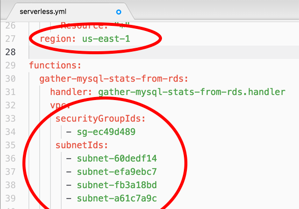
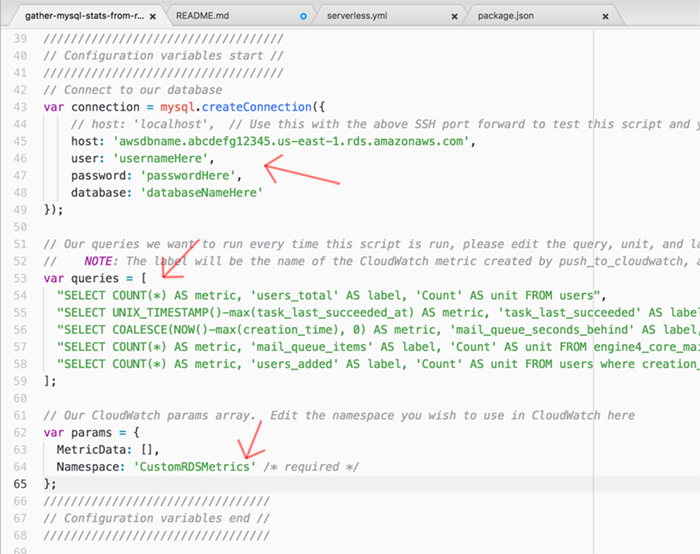
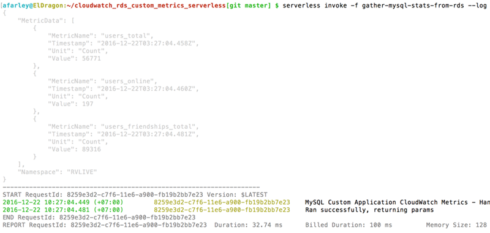
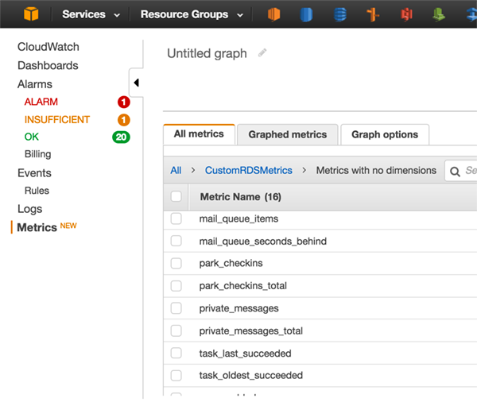
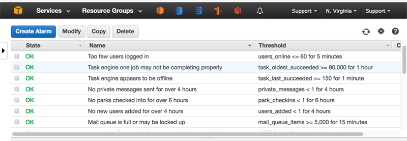
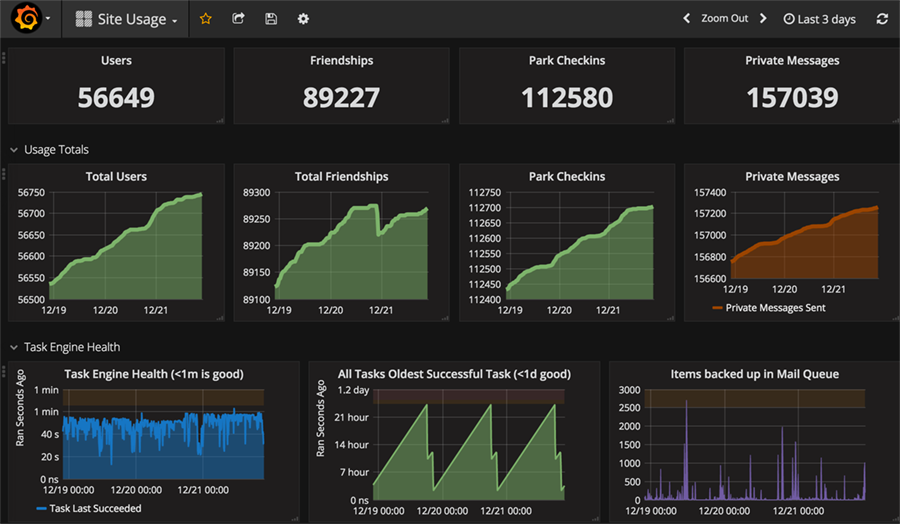

# CloudWatch RDS Custom Metrics

**Found at:** https://github.com/AndrewFarley/serverless-cloudwatch-rds-custom-metrics
## Author
* Farley
  * farley _at_ **olindata**  _dot_ com   _OR_
  * farley _at_ **neonsurge** _dot_ com

## Purpose
1. Collect custom metric (querying data) from an RDS server and push those metrics into CloudWatch Metrics regularly.
1. Doing this without having to have a server via AWS Lambda and Serverless.
1. Able to use the custom metrics for creating dashboards to view current and hisorical data easily (see [usage examples](#usage-examples))
1. Able to use the custom metrics to trigger CloudWatch Alarms and AWS AutoScaling actions.


## Prerequisites

- [Serverless Framework v1.0+](https://serverless.com/)
- [Nodejs v4.3+](https://nodejs.org/)
- [Setup your AWS credentials](https://serverless.com/framework/docs/providers/aws/guide/credentials/)

## Setup

* Make sure your CLI has a default AWS credentials setup (via ```aws configure```) or that you have chosen a profile and can use the aws CLI properly on your terminal.  Additionally make sure you have NodeJS installed 4.3+ installed on your machine.

* Clone this repository with ```git clone git@github.com:AndrewFarley/serverless-cloudwatch-rds-custom-metrics.git``` then enter the folder with ```cd serverless-cloudwatch-rds-custom-metrics``` and run ```npm install``` to grab the bluebird and mysql packages necessary to run these lambdas.

* Edit the file ```serverless.yml``` and put your region (in the provider section) and fill out the security group and subnet ids of your VPC in which your RDS server lives in that region.



* Edit the file ```gather-mysql-stats-from-rds.js``` in the configuation values area around line 40, you'll be filling in the following blanks you see below.  You will want to...
  1. Put your MySQL Server hostname/username/password/database
  1. Put some queries you'd like to gather from your system.  Make sure they are hitting indexes and return VERY quickly if you plan to run this every minute (default)
  1. Customize the namespace you wish to put your custom metrics into (optional)



* Once you've got things configured, try deploying and invoking the mysql function with: ```serverless deploy && serverless invoke -f gather-mysql-stats-from-rds --log```

  * **WARNING:** There is a bug in serverless 1.2 or less which gives errors about _CreateNetworkInterface_ when your first deploy has a function in a custom VPC.  You may need to comment the entire VPC block out at first to get it to deploy at least once successfully, and then uncomment it and re-deploy.  Please see [merge](https://github.com/serverless/serverless/pull/2743) and [bug](https://github.com/serverless/serverless/issues/2780) and [bug](https://github.com/serverless/serverless/issues/2683).

* You should see something like this (of course, with your queries instead)



* If that works, then everything should be working already, because it also deployed the lambda push-to-cloudwatch which is scheduled to run every minute in serverless.yml via CloudWatch Events.

* To verify this is running correctly, please check CloudWatch Metrics to see if your custom metrics are posted, they should show up immediately (within' a minute).  If they are not there, try invoking this method manually with ```serverless invoke -f push-to-cloudwatch --log``` to debug why it is failing, which could be a failing query, invalid MySQL credentials, wrong VPC, or more.  CloudWatch logs should tell you immediately.  When this runs successfully, you should see something similar to the image below in your AWS Dashboard.




## Usage Examples

* To create cloudwatch alarms based on custom metrics to send notifications or trigger automatic actions such as autoscaling.



* To leverage the cloudwatch metric storage backend with some dashboard technology to create useful and engaging dashboards (for example, with [Grafana](https://grafana.net))




## FAQ

**Q:** Why did you do this / what is this for?

**A:** Ever since AWS extended its CloudWatch Metrics to allow for storing 15 months of historical data (as of November 2016) it has removed the need to maintain an additional monitoring system for AWS-based infrastructures for historical data (such as Zabbix/Nagios/Icinga/etc).  And in that paradigm without a physical server that runs our monitoring software, you may not have a non-dynamic server to run custom metrics collection on.  Leveraging Amazon's serverless technologies via Lambda and CloudWatch Events allows us to still gather custom metrics and trigger alarms about subsystem failures and deliver high quality dashboards for ourselves and our clients.


**Q:** Why do you have two Lambdas instead of just one?

**A:** Unless you pay for the NAT Gateway service, or you setup your own NAT Gateway and setup the routes for it, Lambdas inside a VPC can not get "out" and they can not communicate with services like CloudWatch.  This dual-lambda system was designed to work around that limitation, one Lambda is in the VPC (the MySQL one) and one is not (the one that reports to Cloudwatch), with one lambda calling the other asynchronously and waiting for it to return with data.  If you are paying for or have a NAT gateway setup you could fairly easily integrate these two scripts yourself, it should be fairly trivial.


**Q:** What does all this cost?  Doesn't it cost a lot to run this lambda every minute?

**A:** Lambda is extremely cheap especially if you keep the RAM size down, and the runtime down, which we are doing for both.  The RAM for the Lambda is set to 128 (the smallest) and the runtime in my two installations of this software is 100ms each.  Since there are two Lambdas, this works out to 86400 100ms 128MB Lambda executions (60 min \* 24 hour \* 30 days \* 2 lambdas).  Using the [lambda pricing calculator](https://s3.amazonaws.com/lambda-tools/pricing-calculator.html) calculator, this works out to around $0.04/mo not including some minor data transfer fees.  The larger cost is actually every custom CloudWatch metric costs $0.50, and every CloudWatch Alarm you create costs $0.10/mo.  The piece here that costs is the metrics really, not the alarms or Lambdas.  But compared to running your own server or cluster of servers to maintain this monitoring and historical information will typically be well over the cost of paying for a handful of CloudWatch metrics.


## Todo List / Known Bugs

1. Define the Lambda called in push-to-cloudwatch dynamically based on the environment name and the stage name
1. Make a PGSQL version, or expand current version to _somehow_ support both
1. Make a MSSQL version (based on C# if necessary)

## Development / Testing

* To develop/test the MySQL script, I typically setup a SSH port forward
from my local machine to my jumpbox in the VPC in which RDS lives
so I can test the queries below.  You can also/instead simply run this script on a server in your VPC, or VPN into your VPC.  If you choose the jumpbox route the command(s) to run
(in Linux/OS-X) to do this is...

```
LOCALPORT="3306" && \
REMOTEPORT="3306" && \
REMOTEHOST="rds-hostname-here.us-east-1.rds.amazonaws.com" && \
URL="username@jumpbox.myawesomeservice.com" && \
ssh -N -L $LOCALPORT:$REMOTEHOST:$REMOTEPORT $URL
```

* And then I uncomment the last line in the file gather-mysql-stats-from-rds.js (for development/testing only) and then try to run it with ```node gather-mysql-stats-from-rds```.  This works fairly well and is much more iterable than having to constantly deploy to lambda just to test.


## Removal

Simple remove with the serverless remove command

```
serverless remove
```


## Changelog / Recent Features

* Added an exception handler to catch exceptions in the MySQL queries within' the mapped promises.


## Support, Feedback & Questions

Please feel free to file Github bugs if you find any.  It's probably easier if you fork my repo to make your own modifications detailed above and commit them.  If you make any fixed/changes that are awesome, please send me pull requests or patches.

If you have any questions/problems beyond that, feel free to email me at one of the emails in [author](#author) above.
